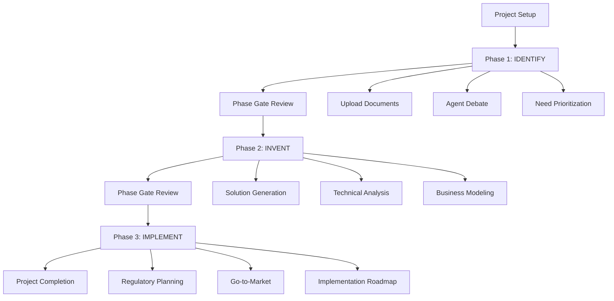

# User Experience Guide

## Bio-Design Innovation Platform UX Design

This document outlines the complete user experience design for the Bio-Design Multi-Agent Innovation Platform, focusing on the Stanford Biodesign methodology's three-phase innovation process enhanced with AI agent collaboration.

## 🎯 User Journey Overview

### Primary User Flow: Complete Innovation Cycle



## 🚀 Onboarding Experience

### First-Time User Journey

#### 1. Welcome & Platform Introduction
**Screen: Platform Landing**
- **Goal**: Help users understand the three-phase innovation process
- **Duration**: 2-3 minutes
- **Key Elements**:
  - Interactive demo of Stanford Biodesign methodology
  - Visual explanation of AI agent roles
  - Benefits of structured innovation approach

```
┌─────────────────────────────────────┐
│           Welcome to Bio-Design      │
│        Innovation Platform          │
│                                     │
│  🔍 IDENTIFY → 💡 INVENT → 🚀 IMPLEMENT │
│                                     │
│     [Start Interactive Tour]        │
│     [Create First Project]          │
│                                     │
│  "Transform healthcare through      │
│   systematic innovation"            │
└─────────────────────────────────────┘
```

#### 2. Project Creation Wizard
**Screen: New Project Setup**
- **Goal**: Capture initial project context and goals
- **Duration**: 3-5 minutes
- **Guided Steps**:
  1. Project title and description
  2. Healthcare domain selection
  3. Team member invitations
  4. Initial document upload (optional)

#### 3. Phase Introduction
**Screen: Phase 1 Preparation**
- **Goal**: Explain IDENTIFY phase objectives and process
- **Duration**: 1-2 minutes
- **Interactive Elements**:
  - Agent introduction carousel
  - Phase objectives checklist
  - Expected outcomes preview

## 📱 Interface Layout Patterns

### Master Layout Structure
```
┌─────────────────────────────────────────────────────┐
│ Header: Logo | Navigation | Phase Indicator | User  │
├─────────────────────────────────────────────────────┤
│ Sidebar        │ Main Content Area                  │
│ • Project Nav  │                                    │
│ • Phase Menu   │ ┌─────────────────────────────────┐ │
│ • Agent Status │ │                                 │ │
│ • Quick Upload │ │        Phase Content            │ │
│                │ │                                 │ │
│                │ └─────────────────────────────────┘ │
│                │                                    │
│                │ ┌─────────────────────────────────┐ │
│                │ │      Agent Debate Panel         │ │
│                │ └─────────────────────────────────┘ │
├─────────────────────────────────────────────────────┤
│ Footer: Progress | Help | Feedback                  │
└─────────────────────────────────────────────────────┘
```

### Responsive Behavior
- **Desktop (1024px+)**: Full sidebar + main content + agent panel
- **Tablet (768-1023px)**: Collapsible sidebar + main content
- **Mobile (< 768px)**: Bottom navigation + full-width content

## 🎭 Phase-Specific UX Patterns

### Phase 1: IDENTIFY - Discovery & Exploration UX

#### Information Architecture
```
IDENTIFY Phase
├── Problem Discovery
│   ├── Document Upload Zone
│   ├── Market Research Input
│   └── Stakeholder Interview Data
├── Multi-Agent Analysis
│   ├── Medical Expert Assessment
│   ├── Business Opportunity Analysis
│   └── Patient Advocate Perspective
├── Need Prioritization
│   ├── Scoring Matrix
│   ├── Feasibility Assessment
│   └── Impact Evaluation
└── Decision Gate
    ├── Selected Needs Summary
    ├── Evidence Package
    └── Phase Advancement Criteria
```

#### Key UX Principles
- **Divergent Thinking Support**: Multiple input methods and exploration paths
- **Evidence-Based Decisions**: Clear citation and source tracking
- **Collaborative Input**: Multi-user document annotation and commenting

#### Critical User Tasks
1. **Upload and organize research materials**
   - Drag-and-drop interface with smart categorization
   - Progress indicators for document processing
   - Automatic content extraction and tagging

2. **Observe agent debates**
   - Real-time conversation view with agent avatars
   - Argument threading and evidence linking
   - User intervention points for clarification

3. **Evaluate and prioritize needs**
   - Interactive scoring matrices
   - Visual comparison tools
   - Consensus building indicators

### Phase 2: INVENT - Solution Development UX

#### Information Architecture
```
INVENT Phase
├── Solution Ideation
│   ├── Concept Generation Tools
│   ├── Innovation Techniques
│   └── Technical Feasibility Input
├── Multi-Perspective Analysis
│   ├── Technical Engineering Review
│   ├── Business Model Development
│   └── Regulatory Considerations
├── Solution Refinement
│   ├── Prototype Planning
│   ├── Risk Assessment
│   └── Resource Requirements
└── Decision Gate
    ├── Selected Solution Architecture
    ├── Business Case Summary
    └── Development Roadmap
```

#### Key UX Principles
- **Creative Exploration**: Freeform ideation tools with structured capture
- **Technical Validation**: Clear feasibility indicators and constraints
- **Business Viability**: Integrated financial modeling and market analysis

#### Critical User Tasks
1. **Generate and refine solution concepts**
   - Visual brainstorming interface
   - Concept combination and evolution tools
   - AI-suggested improvements and alternatives

2. **Evaluate technical feasibility**
   - Interactive technical assessment forms
   - Prototype planning wizards
   - Resource requirement calculators

3. **Develop business models**
   - Business model canvas interface
   - Revenue scenario modeling
   - Market size and opportunity analysis

### Phase 3: IMPLEMENT - Commercialization UX

#### Information Architecture
```
IMPLEMENT Phase
├── Regulatory Strategy
│   ├── Pathway Selection
│   ├── Timeline Planning
│   └── Compliance Requirements
├── Commercial Planning
│   ├── Go-to-Market Strategy
│   ├── Pricing and Distribution
│   └── Sales Model Selection
├── Risk Management
│   ├── Risk Identification
│   ├── Mitigation Strategies
│   └── Contingency Planning
└── Implementation Roadmap
    ├── Milestone Planning
    ├── Resource Allocation
    └── Success Metrics
```

#### Key UX Principles
- **Strategic Focus**: Clear decision frameworks and evaluation criteria
- **Risk Awareness**: Prominent risk indicators and mitigation options
- **Implementation Clarity**: Detailed roadmaps with actionable next steps

#### Critical User Tasks
1. **Plan regulatory approvals**
   - Regulatory pathway wizards
   - Timeline visualization tools
   - Compliance checklists and tracking

2. **Develop commercial strategy**
   - Market analysis dashboards
   - Pricing strategy tools
   - Channel partner planning

3. **Create implementation roadmap**
   - Project planning interfaces
   - Resource allocation tools
   - Success metrics definition

## 🤖 Multi-Agent Interaction Patterns

### Agent Debate Interface Design

#### Real-Time Conversation View
```
┌─────────────────────────────────────────┐
│ Agent Debate: "Diabetes Detection Need" │
├─────────────────────────────────────────┤
│ 👩‍⚕️ Medical Expert    [Online] [Active]   │
│ "Early detection could prevent..."       │
│ Evidence: [3 sources] Confidence: 89%   │
│                                         │
│ 👨‍💻 Tech Engineer     [Online]           │
│ "Current sensors lack sensitivity..."    │
│ Evidence: [2 sources] Confidence: 76%   │
│                                         │
│ 📊 Business Analyst  [Online]           │
│ "Market size suggests $2.1B opportunity"│
│ Evidence: [4 sources] Confidence: 92%   │
├─────────────────────────────────────────┤
│ [💬 Ask Question] [📎 Add Context]      │
│ [⏸️ Pause Debate] [📋 Export Summary]   │
└─────────────────────────────────────────┘
```

#### Agent Status Indicators
- **Online/Offline Status**: Real-time availability
- **Activity Indicators**: Currently speaking, thinking, researching
- **Expertise Confidence**: Color-coded confidence levels
- **Evidence Quality**: Source count and reliability scores

### Consensus Building Interface

#### Agreement Tracking
```
┌─────────────────────────────────────────┐
│ Consensus Building Progress             │
├─────────────────────────────────────────┤
│ Topic: "Primary Target Market"          │
│                                         │
│ 🟢 Strong Agreement (5/7 agents)        │
│ • Hospital emergency departments        │
│ • Primary care clinics                  │
│                                         │
│ 🟡 Partial Agreement (3/7 agents)       │
│ • Home healthcare market               │
│                                         │
│ 🔴 Disagreement (2/7 vs 5/7)           │
│ • Insurance coverage assumptions        │
│                                         │
│ [View Detailed Arguments]               │
│ [Request Agent Synthesis]               │
└─────────────────────────────────────────┘
```

## 📋 Content Management UX

### Document Upload and Management

#### Smart Upload Interface
```
┌─────────────────────────────────────────┐
│ Upload Research Documents               │
├─────────────────────────────────────────┤
│ ┏━━━━━━━━━━━━━━━━━━━━━━━━━━━━━━━━━━━━━━━┓ │
│ ┃     Drop files here or click         ┃ │
│ ┃                                      ┃ │
│ ┃  📄 PDF   🖼️ Images   📊 Spreadsheets ┃ │
│ ┃  📹 Videos 🎵 Audio   📝 Documents    ┃ │
│ ┗━━━━━━━━━━━━━━━━━━━━━━━━━━━━━━━━━━━━━━━┛ │
│                                         │
│ Smart Processing Options:               │
│ ☑️ Extract key concepts                  │
│ ☑️ Generate summaries                    │
│ ☑️ Create visual annotations             │
│ ☑️ Enable agent analysis                 │
│                                         │
│ [Upload Files] [Paste URL] [Scan QR]    │
└─────────────────────────────────────────┘
```

#### Content Organization
- **Automatic Categorization**: AI-powered content classification
- **Tag Management**: User-defined and auto-generated tags
- **Version Control**: Document revision tracking
- **Search and Filter**: Multi-criteria content discovery

### Multimodal Content Interface

#### Visual Content Analysis
```
┌─────────────────────────────────────────┐
│ Medical Image Analysis                  │
├─────────────────────────────────────────┤
│ ┌─────────────┐ ┌─────────────────────┐ │
│ │             │ │ AI Analysis Results │ │
│ │   [IMAGE]   │ │                     │ │
│ │             │ │ 🔍 Key Findings:    │ │
│ │ X-Ray Scan  │ │ • Potential lesion  │ │
│ │             │ │ • Size: 1.2cm       │ │
│ └─────────────┘ │ • Confidence: 87%   │ │
│                 │                     │ │
│ [🏷️ Add Tags]   │ 📋 Agent Insights:  │ │
│ [✏️ Annotate]   │ • Medical relevance │ │
│ [📤 Share]      │ • Technical specs   │ │
│                 │ • Market impact     │ │
│                 └─────────────────────┘ │
└─────────────────────────────────────────┘
```

## 🎨 Visualization and Concept Mapping

### Interactive Diagram Generation

#### Mermaid Diagram Interface
```
┌─────────────────────────────────────────┐
│ Concept Map Generator                   │
├─────────────────────────────────────────┤
│ Diagram Type: [Flowchart ▼]             │
│                                         │
│ ┌─────────────┐ ┌─────────────────────┐ │
│ │   Canvas    │ │   Properties Panel  │ │
│ │             │ │                     │ │
│ │   [Auto-    │ │ Selected: Node A    │ │
│ │   generated │ │ Label: [_________]  │ │
│ │   diagram]  │ │ Color: [🎨]         │ │
│ │             │ │ Shape: [□ ▼]        │ │
│ │             │ │                     │ │
│ │             │ │ [Delete] [Duplicate] │ │
│ └─────────────┘ └─────────────────────┘ │
│                                         │
│ [🤖 AI Generate] [✏️ Manual Edit]        │
│ [💾 Save] [📤 Export] [👥 Collaborate]   │
└─────────────────────────────────────────┘
```

#### Collaborative Editing Features
- **Real-time Collaboration**: Multiple users editing simultaneously
- **Version History**: Complete change tracking and rollback
- **Comment System**: Contextual feedback and discussion
- **Export Options**: SVG, PNG, PDF, and interactive HTML

## 📊 Progress Tracking and Analytics

### Project Dashboard
```
┌─────────────────────────────────────────┐
│ Project: AI Diabetes Detection Device   │
├─────────────────────────────────────────┤
│ ████████████████████████████░░░░ 70%    │
│ Phase 2: INVENT (In Progress)           │
│                                         │
│ 📈 Key Metrics:                         │
│ • Needs Identified: 8                   │
│ • Solutions Generated: 15               │
│ • Agent Debates: 23                     │
│ • Documents Processed: 47               │
│                                         │
│ 🎯 Next Milestones:                     │
│ • Complete technical feasibility        │
│ • Finalize business model               │
│ • Prepare implementation plan           │
│                                         │
│ 👥 Team Activity:                       │
│ • John: Added 3 documents today         │
│ • Sarah: Reviewed agent debates         │
│ • Mike: Updated project timeline        │
└─────────────────────────────────────────┘
```

### Phase Completion Tracking
- **Milestone Indicators**: Visual progress markers
- **Completion Criteria**: Clear requirements for phase advancement
- **Quality Gates**: Validation checkpoints before proceeding
- **Team Coordination**: Shared progress visibility

## 🔄 Error States and Edge Cases

### Graceful Error Handling

#### Network Connectivity Issues
```
┌─────────────────────────────────────────┐
│ ⚠️ Connection Lost                       │
├─────────────────────────────────────────┤
│ Your work has been saved locally.       │
│                                         │
│ We'll automatically reconnect when      │
│ your internet connection is restored.   │
│                                         │
│ ┌─────────────────────┐                 │
│ │ [Working Offline]   │                 │
│ │ • View documents    │                 │
│ │ • Edit diagrams     │                 │
│ │ • Draft content     │                 │
│ └─────────────────────┘                 │
│                                         │
│ [Retry Connection] [Continue Offline]   │
└─────────────────────────────────────────┘
```

#### Agent Unavailability
```
┌─────────────────────────────────────────┐
│ 🤖 Agent Temporarily Unavailable        │
├─────────────────────────────────────────┤
│ Medical Expert Agent is experiencing    │
│ high demand. Estimated wait: 2 minutes  │
│                                         │
│ Options while you wait:                 │
│ • Continue with other agents            │
│ • Review previous analysis              │
│ • Upload additional documents           │
│                                         │
│ [Continue with Available Agents]        │
│ [Wait for Medical Expert]               │
└─────────────────────────────────────────┘
```

### Loading States

#### Document Processing
```
┌─────────────────────────────────────────┐
│ Processing Documents...                 │
├─────────────────────────────────────────┤
│ research_paper.pdf                      │
│ ████████████████████░░░░ 85%            │
│ Extracting key concepts...              │
│                                         │
│ market_analysis.xlsx                    │
│ ████████████████████████ 100% ✓        │
│                                         │
│ interview_transcripts.docx              │
│ ████████░░░░░░░░░░░░░░░░░ 35%            │
│ Analyzing stakeholder feedback...       │
│                                         │
│ Estimated completion: 2 minutes         │
│ [Cancel Processing]                     │
└─────────────────────────────────────────┘
```

## 📱 Mobile Experience Considerations

### Responsive Adaptations

#### Mobile Navigation
- **Bottom Tab Bar**: Phase navigation and key actions
- **Swipe Gestures**: Navigate between screens and content
- **Floating Action Button**: Quick access to primary actions
- **Progressive Disclosure**: Simplified interfaces with expandable details

#### Touch-Optimized Interactions
- **Minimum Touch Targets**: 44px minimum for interactive elements
- **Gesture Support**: Pinch-to-zoom for diagrams and images
- **Voice Input**: Speech-to-text for quick content input
- **Offline Capability**: Local storage for continued productivity

---

*This UX guide ensures intuitive, efficient, and delightful user experiences across all aspects of the Bio-Design Innovation Platform.*
